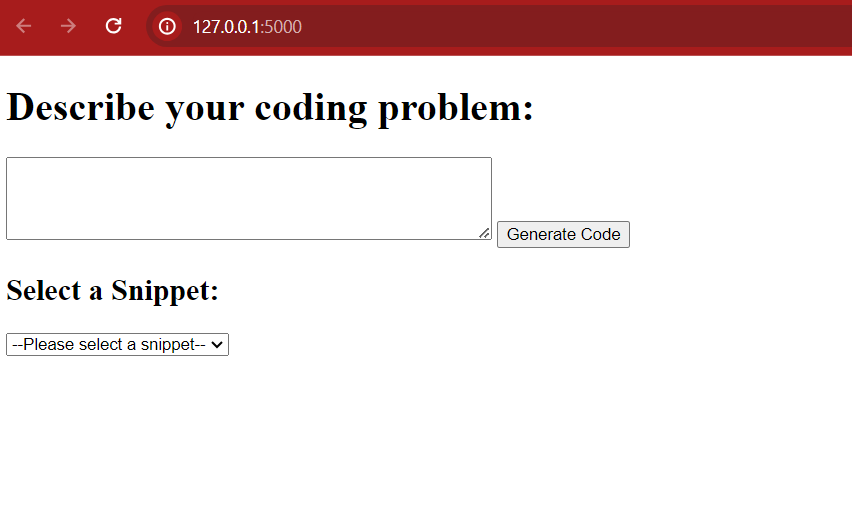
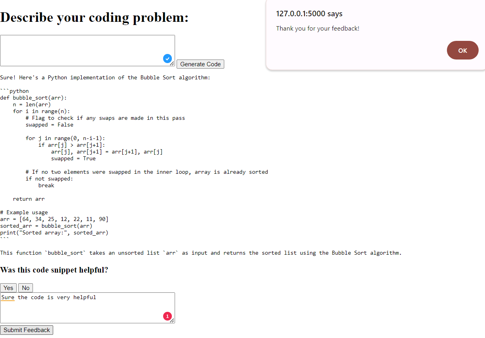
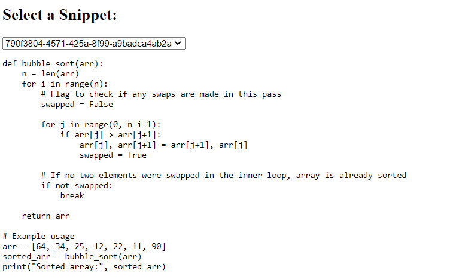

# Autify-Coding-Assessment

# GPT-Turbo 3.5 Code Generation Solution

Welcome to our GPT-Turbo 3.5-powered code generation solution. This tool is designed to aid developers by generating code snippets based on natural language descriptions of programming problems. Leveraging OpenAI's GPT-3.5-Turbo model, it provides a convenient and user-friendly way to quickly obtain code solutions. Additionally, it features a feedback system that stores user feedback in a SQLite database, enabling continuous improvement of the tool.

## Features

- **Code Generation**: Generate code snippets by simply describing your coding problem.
- **Feedback System**: Submit feedback on the generated code to help improve the service.
- **Responsive Web Interface**: Easily interact with the code generation tool through a streamlined web interface.
- **Persistent Storage of Feedback**: User feedback is stored in a SQLite database for later analysis and enhancement purposes.
- **Snippet Management**: Snippets are stored in in-memory data structure where User can see previously generated snippets in a dropdown.
- **Prompt Security**: Restricted code on doing any other task other than code generation using prompt engineering. Provided examples
in the prompt along with checked prompt on its length and any other keyword for avoiding prompt injection attack.

## Structure

The assignment comprises several key files:

- `app.py`: The Flask application server handling web requests and integrating with the GPT-3.5-Turbo API for code generation.
- `templates/index.html`: A basic HTML template for the user interface.
- `custom_llm.py`:  This script is added for custom llm_integration. Right now `CodeLlama` is being used for code generation. 
- `Dockerfile`: For containerizing and deploying the application.
- `feedback.db`: SQLite database for storing feedback.
- `requirements.txt`: Lists all Python package dependencies.
- `db_utils.py`: Contains utility functions for interacting with the SQLite database.

## Installation & Running

### Pre-requisites
- Python 3.10+ installed on local machine
- Docker installed on your machine.
- An OpenAI API key set as an environment variable `OPENAI_API_KEY`. It can be setup on any machine on Windows using 
```bash
setx OPENAI_API_KEY “<yourkey>”
```

### Steps to Run
There are two options to run this solution
1. Using Python virtual environment
2. Using Docker

### Using Python Virtual Environment:
1. **Install requirements in virtual environment using:**
```pip install -r requirements.txt```

2. **Run database creation file to create sqlite database:**
```python db_utils.py```

3. **Run main application file:**
```python app.py```

- Visit `http://127.0.0.1:5000/` to start using flask application. 


4. **Submit Feedback, If required:**



5. **Visit previous generated snippets, If required by selecting one from dropdown:**



### Using Docker:
1. **Build the Docker Image**

   Navigate to the project directory and run:

   ```bash
   docker build -t code-generation-solution .
   ```

2. **Run the Docker Container**

   After the build completes, start the container:

   ```bash
   docker run -dp 5000:5000 --ipc=host -e OPENAI_API_KEY='your_openai_api_key_here' code-generation-solution
   ```

   Replace `'your_openai_api_key_here'` with your actual OpenAI API key.

3. **Access the Web Interface**

   Open a web browser and navigate to `http://127.0.0.1:5000` to interact with the code generation tool.

## Using the Application

- Describe your coding problem in the text box provided on the homepage.
- Click the "Generate Code" button to receive a code snippet.
- Optionally, you can submit feedback for the generated code to help improve future responses.

## Custom LLM's
For the custom LLM, we have used CodeLlama-7b python. The script `custom_llm.py` is present which can be used for 
running either locally or on a GPU server with detailed prompt for code generation. Here's the [document](https://drive.google.com/file/d/1FOW8lO2xfz35VFNT3qN08_x6l_GVywco/view?usp=sharing) having detailed explaination about:
- Cost-Performance Analysis
- Scaling Challenges
- Script for Running Llama Locally or on a GPU Server

